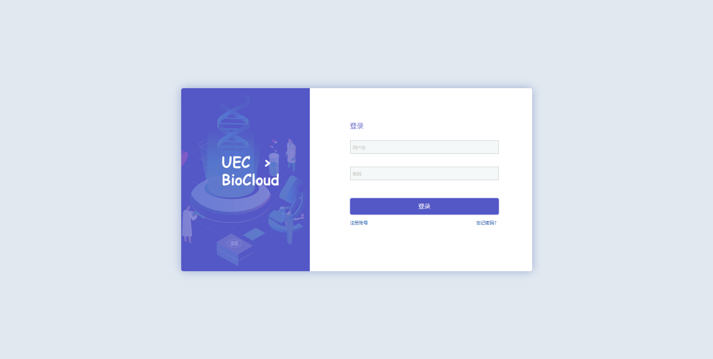

# 
登录生信平台

-------

本文将向大家介绍如何通过浏览器登录到生信平台。

本文主要内容：

 * 生信平台登录的注意事项；
 * 首次登录准备；
 * 故障排除和反馈。
 
按照文档的操作说明将有助于您完成工作，谢谢您的配合！

# 注意事项

 * 账号仅限于同一课题组的成员使用，请勿将账号借给他人使用。
 * 请妥善保管好您的账号密码，不要告知他人。管理员不会要求您提供密码。
 * 若无法登录，请检查输入密码或确认IP地址是否正确。您可以参考故障排除和反馈，将诊断信息发送给集群管理员hpc@sjtu.edu.cn。

# 登录准备
 * 登录账号和密码。
 * 网页浏览器，推荐Chrome，Firefox。
 * 登陆地址：[生信平台入口点击此处](http://111.186.56.254:3500/)

*提示：为了便于叙述，以下文档内容将遵循上述信息。在实际操作中，请参阅收到的电子邮件，并注意您的登录信息。*
 
## 登陆演示
### 步骤1
打开网页浏览器，输入生信平台地址：**`http://111.186.56.254:3500/`**

### 步骤2
在用户名和密码栏填写您的登录信息后点击登录。

 

# 登陆遇到问题
 * 请检查网络状态。
 * 清除浏览器缓存。
 * 联系管理员解决。